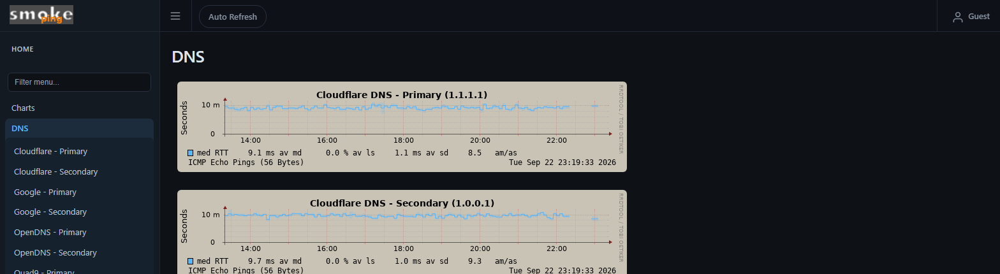
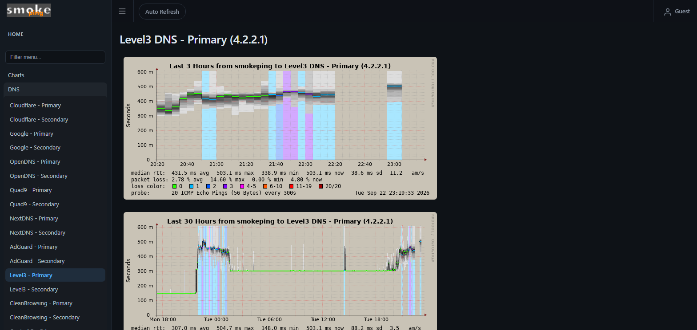
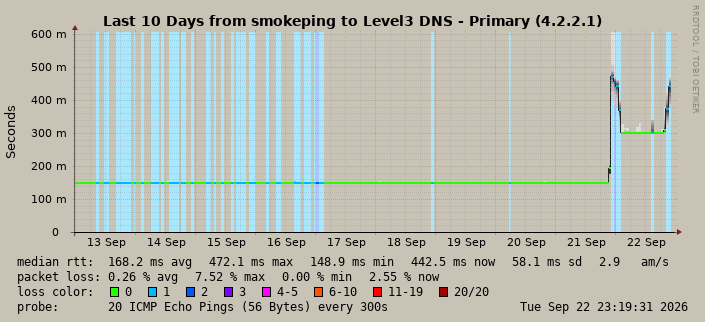
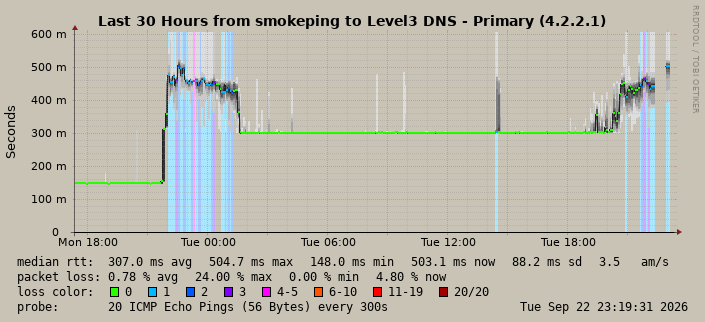

# SmokePing Dark Theme

A presentation-only dark page theme for [SmokePing](https://oss.oetiker.ch/smokeping/) 2.9 and newer. The surrounding UI uses dark surfaces, while SmokePing's stock graph renderer uses a soft blue-grey canvas so the traces, smoke, grid, and black step connectors remain easy to read. No probes, RRD files, retention settings, or collected latency data are changed.

## What it provides

- Dark sidebar, navbar, panels, graph containers, and footer.
- SmokePing's stock graph colours, smoke, grid, axes, zero rule, and connector.
- Presentation canvas `#c9c3b6`, matching the stylesheet's `--graph-bg` value.
- Optional DejaVu graph fonts with matching drag-to-zoom margins.
- Responsive layout, accessible links, print styles, and the existing SmokePing JavaScript assets.

## Screenshots

These examples show the current theme and graph presentation:









## Presentation settings

Set these values in the `*** Presentation ***` section:

```ini
graphborders = no
colorbackground = c9c3b6
```

Leave `colortext` unset so SmokePing uses its stock graph text colour. Leave the overview and detail dimensions at SmokePing's defaults. An overview median accent can be set separately with `median_color = 58b7ff` in the `+ overview` section.

## Files

| File | Purpose |
| --- | --- |
| `basepage.html` | SmokePing page template with the dark stylesheet link and inline favicon |
| `css/smokeping-dark.css` | Dark page stylesheet; `--graph-bg` matches `colorbackground` |
| `apache/theme-alias.conf` | Apache alias that serves the persistent theme directory |
| `custom-cont-init.d/10-dark-graphs.sh` | Idempotent startup patch for DejaVu graph fonts and matching zoom margins |
| `uninstall-dark-graphs.sh` | Safe reverse helper for the optional font and zoom-margin patch |
| `docs/images/` | Theme and graph examples used in this document |

The startup patch is limited to graph font declarations and the matching zoom margins. It does not change graph colours, smoke, grid, axes, connectors, canvas, or renderer behaviour. Both scripts skip files that do not contain their patch marker.

## Install on the linuxserver/smokeping Docker image

The container webroot is not persisted, so place the theme files in the config volume and mount the startup-script directory.

1. Copy the template, stylesheet, and startup script:

   ```sh
   mkdir -p /path/to/smokeping/config/theme /path/to/smokeping/custom-cont-init.d
   cp basepage.html css/smokeping-dark.css /path/to/smokeping/config/theme/
   cp custom-cont-init.d/10-dark-graphs.sh /path/to/smokeping/custom-cont-init.d/
   chmod 755 /path/to/smokeping/custom-cont-init.d/10-dark-graphs.sh
   ```

2. Mount the directories in the compose file:

   ```yaml
   volumes:
     - ./config:/config
     - ./data:/data
     - ./custom-cont-init.d:/custom-cont-init.d:ro
   ```

3. Add the alias from `apache/theme-alias.conf` to `config/site-confs/smokeping.conf`, above the existing `Alias /smokeping ...` line:

   ```apache
   Alias /smokeping/theme /config/theme
   <Directory "/config/theme">
       Require all granted
   </Directory>
   ```

4. In `config/Presentation`, point to the template and set the graph presentation values:

   ```ini
   *** Presentation ***

   template = /config/theme/basepage.html
   charset  = utf-8
   graphborders = no
   colorbackground = c9c3b6
   ```

   Leave `colortext` unset and leave the overview and detail dimensions at SmokePing's defaults.

5. Recreate the container and clear only rendered graph images. This does not touch RRD history:

   ```sh
   docker compose up -d --force-recreate
   docker exec smokeping sh -c \
     'find /var/cache/smokeping -name "*.png" -not -name smokeping.png -not -name rrdtool.png -delete'
   ```

## Install on a native SmokePing host

1. Copy `basepage.html` and `css/smokeping-dark.css` to locations served by SmokePing.
2. Adjust the stylesheet link in `basepage.html` if the CSS is not served at `theme/smokeping-dark.css`.
3. Set `template = /path/to/basepage.html` in the Presentation section and add:

   ```ini
   graphborders = no
   colorbackground = c9c3b6
   ```

   Leave `colortext` unset and leave the overview and detail dimensions at SmokePing's defaults.
4. To use the improved graph typography, adjust `GR` and `JS` at the top of `custom-cont-init.d/10-dark-graphs.sh`, then run it as a root startup hook.

## Updating or removing the optional graph patch

Copy the updated theme files and restart or recreate SmokePing. The startup script is safe to rerun and skips files carrying its `dark-font-patch` marker.

To remove the font and zoom-margin changes from a native install or running container, adjust the paths in `uninstall-dark-graphs.sh` when needed and run:

```sh
bash uninstall-dark-graphs.sh
```

The helper only changes files carrying the `dark-font-patch` marker and never touches RRD files.

## Credits

SmokePing is by Tobi Oetiker and Niko Tyni.
